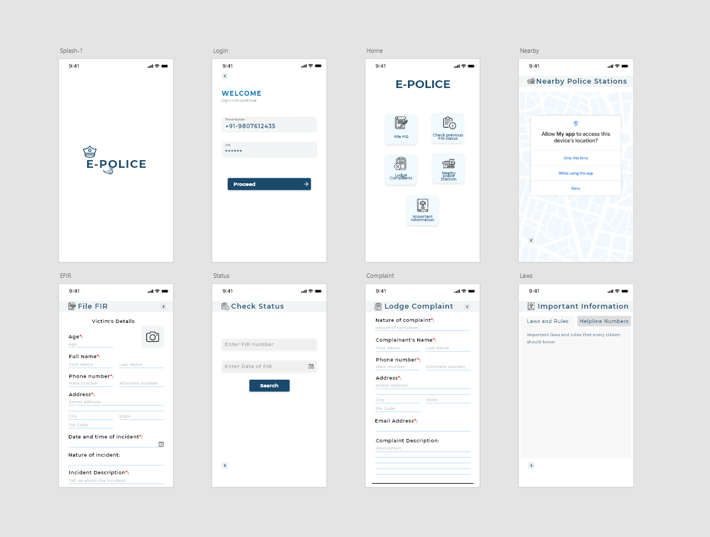

 
	
# An Smart E-Policing App based on FLUTTER

## Abstract

•	We will be starting an “E-POLICE” app. Through which any victim can file a FIR or lodge any online complaint.

•	Also, users will be able to track their previous filled FIR or complaints.

•	There will be a location feature through which the nearest police station will come into action as the FIR will be under their control.

•	There will be a proper verification of the person who is filing the FIR.

## Functionalities:
* E-FIR
    - OTP login 
    - FIR form - authenticate with face id.
	- Check previous FIR status.

* E-Complaints
    - Complaint form
    - Check previous complaint status.

* Nearby Police station
    - show nearby police station according to user location.

* Important laws, rules and helpline numbers.

